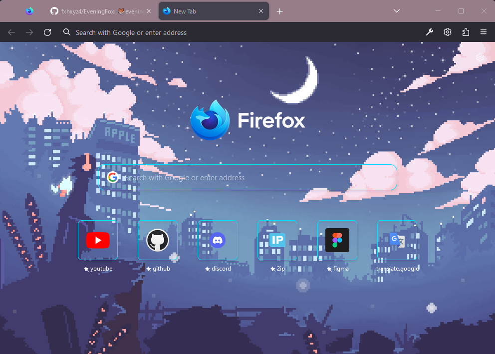

## 🦊EveningFox

### evening-theme for firefox

#

## > installation

- Enable the legacy Firefox CSS customizations by setting the `toolkit.legacyUserProfileCustomizations.stylesheets` to true in
  `about:config`.
- Copy the chrome folder into your Firefox profile directory. (To access this folder, go to `about:profiles`).
- Restart Firefox. `🦊`

## > change background

- Open profile directory > chrome > background > change this file (formats: jpg, gif, png, mp4).

- Restart.

## > uninstall

- delete chrome folder into your Firefox profile directory.

## > more questions?

- [write in issues](https://github.com/fxhxyz4/EveningFox/issues)
